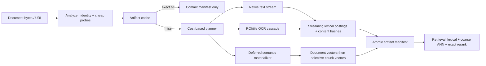
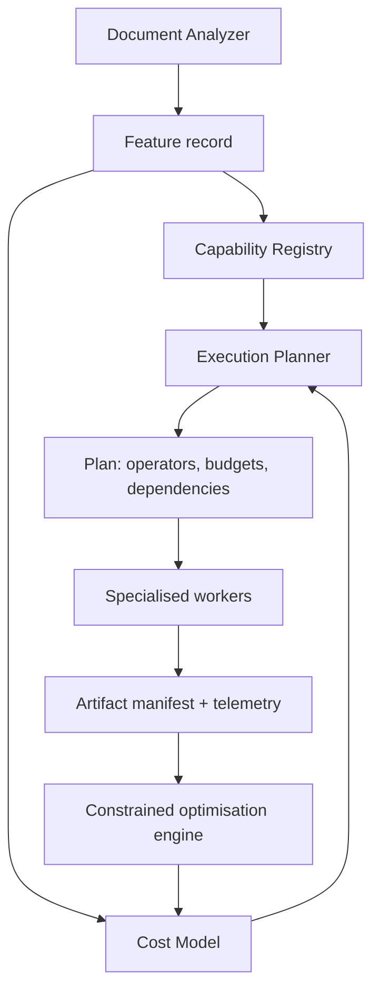

# Amar Vault: Frontier Indexing Architecture

**Objective:** minimise indexing latency, energy, peak native memory, bitmap allocation, model invocations, and writes **without silently reducing retrieval quality**.

**Decision:** retire the fixed `extract -> OCR -> chunk -> embed -> write` pipeline. Replace it with a cost-based, page-granular planner. OCR and embedding become optional physical operators, selected only when a quality-preserving execution plan requires them.

This is a redesign proposal, not an incremental tuning plan. Existing APIs and most of the current indexing implementation may be removed.

## 1. Current Bottlenecks

The benchmark identifies an architectural, not merely implementation, failure: expensive operators are unconditional.

| Evidence from reconstructed report | Architectural diagnosis | Consequence |
|---|---|---|
| `stage.share.pageOcr = 70.7911%`; OCR image and render add `10.7434%` and `10.0171%` | OCR is the dominant physical operator. | Optimising Room, BM25, or metadata first cannot move end-to-end throughput materially. |
| 950 / 1,805 PDF pages take OCR fallback (52.63%). | The text-layer gate routes too many pages into an expensive image pipeline, including potentially clean sparse pages. | Rendering and OCR occur where byte/text inspection could have ended the plan. |
| PDF tier-1 OCR accepts 36.63% of fallback pages; the rest trigger the full ensemble. | The escalation ladder remains too coarse. | Most fallback pages still execute several recognizers and bitmap transformations. |
| Raw OCR has 57.59% contribution and is most efficient; grayscale, invert, and upscale add far less. | The image path runs an ensemble rather than an adaptive cascade. | Work is performed before there is evidence it is needed. |
| Native heap ~2.06 GB; RAM peak ~2.35 GB while Java heap used is ~107 MB. | Bitmap/OCR/model lifetimes dominate memory; asynchronous fan-out multiplies transient state. | GC and native allocation pressure turn a latency problem into a stability problem. |
| Embedding generation averages 759 ms in one report and observed embedding 3,570 ms/doc in another. | Embedding is being treated as an ingest obligation rather than a retrieval-demanded artifact. | Indexing pays semantic cost for content that may never be searched semantically. |
| Search components are measured in single-digit milliseconds, while end-to-end retrieval is ~735 ms and quality has 0 scored queries. | The benchmark does not establish an end-to-end quality/latency truth set. | It is unsafe to claim a quality-preserving optimisation today. |

The source code confirms the central pathology: non-PDF images invoke the five-strategy ensemble unconditionally. The correct unit of optimisation is not a Kotlin function; it is the **work decision**.

## 2. Impossible Assumptions

Remove these assumptions from the product and codebase.

1. **Every document must be fully indexed at import.** Import should create a durable identity and a cheap lexical representation; expensive enrichment can be deferred without losing the document.
2. **Every PDF page without "perfect" native text must be OCR'd.** A clean sparse title page is not corrupt. A scanner-only page is. These require different plans.
3. **Every image needs every recognizer.** Multiple recognizers are experts in a cascade, not parallel mandatory stages.
4. **Every page must become an embedding immediately.** Semantic coverage is a policy with a quality contract, not an ingest side effect.
5. **Chunking is an independent materialization step.** Tokenisation, lexical posting construction, content hashing, and chunk boundaries can be fused in one streaming pass.
6. **A document is the smallest invalidation unit.** Pages, content blocks, and embeddings are independently cacheable artifacts.
7. **Bitmap is the canonical intermediate representation.** It is an expensive, lossy-to-memory API boundary. The canonical representation should be immutable bytes or a compact grayscale/tiled image plane.
8. **More concurrency means more speed.** At 2.35 GB peak RAM, unconstrained concurrency is a throughput collapse mechanism.
9. **A fixed threshold is a policy.** A fixed threshold is an unvalidated hypothesis. The planner must condition on source type, page features, device state, and observed outcome.
10. **An approximate semantic index may silently omit unembedded content.** This is a retrieval-quality regression. Deferred semantic work needs an explicit completeness contract and a lossless fallback.

## 3. New Architecture

### Design invariants

- **Never compute without a proof of need.** A skip requires a certificate: exact content identity, valid native text, accepted OCR output, or cached versioned artifact.
- **No silent recall loss.** If semantic coverage is incomplete, the retrieval engine either completes the required work before finalising the result or exposes a clearly incomplete result; it never pretends the index is complete.
- **Materialize once.** Each expensive artifact has a content address and a schema/model version. Equal input + equal version reuses the artifact byte-for-byte.
- **Bound every resource.** Each plan has a deadline, byte budget, energy budget, and quality floor.

### Physical data model

Use an append-only, content-addressed artifact store with a compact manifest—not a chain of mutable stage tables.

`DocumentKey = BLAKE3(canonical bytes) + import policy version`

`PageKey = BLAKE3(document key, page object bytes or rendered-source identity)`

`ArtifactKey = BLAKE3(input key, operator version, model version, language policy)`

Artifacts: native text spans, OCR spans with confidence/provenance, token stream, lexical postings, document synopsis vector, chunk vector, thumbnail, and quality certificate. The manifest points to immutable artifacts and is committed in a single write batch/journal record. A re-import, rename, or metadata change should not cause OCR or embeddings.

### Execution plans

The planner emits an explicit plan per document and per page:

| Plan | Preconditions | Work | Quality certificate |
|---|---|---|---|
| `REUSE` | exact artifact key exists | no decode, OCR, chunk, embed, or rewrite | hash + operator/model version match |
| `TEXT_ONLY` | native text is structurally valid | stream text to postings and document synopsis | parser integrity + text validity rules |
| `OCR_ROI` | visual text is required, localised, or native text is partial | render/detect only required regions at required resolution | OCR confidence + disagreement/coverage test |
| `OCR_ESCALATE` | low confidence or a quality sentinel fails | invoke next specialised recognizer only | stronger recognizer passes quality test |
| `LEXICAL_NOW_SEMANTIC_LATER` | lexical index is durable; semantic SLA permits delay | no embedding on import | semantic completeness bitmap recorded |
| `SEMANTIC_MATERIALIZE` | idle time, user demand, or query coverage requires it | document vector first; chunk vectors only where needed | model version + retrieval evaluation gate |

### OCR redesign

1. Parse PDF object/text layers before rendering. Treat clean sparse text as text, not as an OCR error.
2. For image-only pages, use a tiny preflight classifier on a downsampled luma plane: blank, typed text, handwriting, photograph, table/form, or mixed. This selects the recognizer, language, tile size, and initial resolution.
3. Run one cheap recognizer first. Evaluate coverage, script plausibility, confidence, line geometry, and lexical sanity.
4. Escalate only uncertain regions, not the whole page. The second recognizer sees the failed regions or tiles; it does not repeat the successful ones.
5. Use Tesseract only as a specialised rescue operator. It must never sit in the default path and it must retain the existing timeout/megapixel guard.
6. Train the router from **disagreement data**: periodically shadow-run the expensive expert on a sampled, consented corpus; label cases where the cheap route would have changed retrieval results. This is the safe way to learn routing without assuming OCR confidence is calibrated.

### Index and retrieval redesign

- Build lexical postings while text streams from the parser/OCR. Do not first create a giant string, then chunk it, then retokenize it for BM25.
- Create one compact document-level semantic vector as the first semantic artifact. Use it for candidate generation; materialize chunk vectors for candidate documents, hot documents, or background coverage.
- Maintain two immutable vector tiers: a small, high-recall document graph and a chunk tier. Search document tier first, then chunk tier only for candidate documents. HNSW is a suitable graph family because its hierarchy is designed for efficient approximate search with logarithmic scaling; FAISS documents the index/compression trade space. [HNSW](https://arxiv.org/abs/1603.09320) [FAISS](https://arxiv.org/abs/2401.08281)
- Store compressed vectors plus a small exact rerank set. Compression/approximation is allowed only at candidate generation; final ranking reranks from full-precision vectors or the original embedding representation.
- Collapse per-vector JNI calls. Put vector insertion, quantization, graph build, and batch search behind one batched native boundary or a single in-process engine. JNI is not the dominant current cost, but it should not be a tax on every vector.

## 4. Planner Layer

### Document Analyzer

A bounded, non-OCR inspection pass. It reads headers/metadata, hashes bytes, identifies file/container type, detects prior artifact keys, samples PDF text-layer structure, records page geometry, estimates text density, and produces image features from a small luma thumbnail. It must have a hard byte/time cap and must not decode full pages unless the plan asks for one.

### Capability Registry

Runtime facts, not static assumptions: available CPU cores, accelerator delegates, model residency, RAM headroom, storage throughput, thermal status, charging state, foreground/background state, language packs, and current worker queues. An unavailable or cold model changes the plan cost.

### Cost Model

For plan `p`, choose the feasible plan minimizing:

`E[latency(p)] + a * E[energy(p)] + b * E[peakBytes(p)] + c * E[writes(p)] + d * E[tailRisk(p)]`

subject to `P(retrieval-quality-regression | p) <= epsilon`, a user-visible freshness SLA, and hard device budgets.

Initial estimates come from stratified telemetry (type, page count, megapixels, language, native-text features, device state), using p50/p95 and a conservative uncertainty bound. The planner uses p95, not mean, for memory/thermal admission. The optimisation engine may change a threshold only after an offline golden set and shadow sample prove a lower confidence bound on quality is non-regressive.

### Workers

Workers own resources, not documents: `byte/parser`, `raster/ROI`, `OCR-light`, `OCR-heavy`, `token/postings`, `embedding`, `vector-build`, and `commit`. This allows bounded queues and batch formation. Pass immutable artifact handles, not bitmaps or giant strings, between workers.

### Telemetry and optimisation engine

Record every planned versus executed operator, its input bytes/pixels, queue time, CPU/energy proxy, peak arena bytes, output quality certificate, cache hit/miss, and retrieval impact. The optimisation engine performs constrained offline policy selection; it is not permitted to explore on all user documents. Cache admission can be learned from observed reuse/value, as in ARC and CacheSack, rather than treating all artifacts as equally valuable. [ARC](https://www.usenix.org/conference/fast-03/arc-self-tuning-low-overhead-replacement-cache) [CacheSack](https://www.usenix.org/system/files/atc22-yang-tzu-wei.pdf)

## 5. Removed Computation

The table deliberately gives no invented percentage savings. The existing report is OCR-reconstructed and contains conflicting aggregates, so only a controlled before/after trace can quantify savings.

| Eliminate | Mechanism | Latency / CPU / battery | Peak RAM / writes |
|---|---|---|---|
| Re-indexing identical bytes | content-addressed reuse | all downstream work becomes zero | zero new bitmap/vector/write work except manifest check |
| OCR of valid native PDF text | text-only plan | removes render + OCR; page OCR alone is reported as 70.79% of observed stage share | removes page bitmap transients |
| OCR triggered only by sparse but clean text | distinguish sparse from corrupt | removes a full fallback page plan | removes raster/OCR allocations |
| Full five-pass OCR of easy images | confidence cascade | removes all deferred recognizers/preprocessing after early accept | avoids grayscale, invert, upscale, Tesseract buffers |
| Repeat OCR across successful regions | tiled/ROI escalation | expensive OCR runs only on failed tiles | bounds working set to tile/arena |
| Hindi/other-script recognizer on incompatible pages | language router | removes a model invocation | lowers model contention |
| Full-resolution source and 2x upscale | resolution/ROI planner | removes pixel work that cannot increase recognised detail | eliminates large ARGB transient allocations |
| Immediate embedding for cold content | semantic materialization policy | shifts model cycles out of import critical path | avoids vectors/index writes until valuable |
| Full chunk embedding where doc vector suffices | two-tier ANN | avoids most embedding calls for low-value chunks | lower graph/vector storage |
| Re-tokenization and intermediate strings | fused streaming parser/OCR sink | one pass rather than text -> chunk -> tokenize passes | no large intermediate text graph |
| Per-artifact database commits | manifest + write batch | fewer fsyncs and WAL churn | fewer writes and lower write amplification |
| Per-vector JNI crossings | batch native operator | removes boundary overhead and improves SIMD-friendly layout | avoids short-lived marshaling buffers |

**Measured ceiling, not a promise:** if a page that currently runs OCR is safely classified as valid native text, the reported page-OCR share (70.7911% of the observed profiled stage total) is removed for that page's profiled work. The report's document-level aggregates conflict, so this must not be promoted to an end-to-end speedup claim.

## 6. New Scheduling Model

- **Critical path:** import identity, exact-dedup check, native-text extraction, and atomic lexical commit. This gives immediate searchable availability without waiting for semantic enrichment.
- **Parallelism:** use resource-token admission, not coroutine fan-out. Example tokens: one heavy OCR engine, bounded light OCR workers based on native arena bytes, one raster arena, and an embedding batch worker. A plan cannot start if it would exceed its memory/thermal reservation.
- **Batching:** batch embeddings and vector graph inserts by compatible model/version and sequence length; do not batch OCR just to increase parallelism when it raises bitmap residency.
- **Lazy execution:** semantic chunks, high-resolution OCR, thumbnails, and secondary language passes are materialized on idle time, user opening, or proven query need. Exact-cache and lexical stages are eager.
- **Priority queues:** foreground user-open > document currently queried > recent import > visible collection > charging/idle backfill > archival corpus. Use deadline-aware scheduling within a class.
- **Thermal awareness:** at warm/hot state, stop heavy backfill first, lower concurrency, and prefer cache/text-only plans. Do not reduce a quality-required plan; postpone it or report pending enrichment.
- **Memory awareness:** worker arenas are fixed-size pools. A plan may downgrade from whole-page to tiled OCR, but may not allocate outside its reservation. Evict recomputable image artifacts first; preserve durable text/vector artifacts according to reuse value.
- **Cancellation:** persist completed page/artifact manifests immediately. Cancelled work loses only the current operator, never an entire document's prior results.

## 7. Research Ideas

1. **Retrieval-aware OCR routing.** Train the router on whether an OCR escalation changes top-k retrieval results, not character error rate alone. It learns the value of an extra OCR pass for search, which is the product objective.
2. **Proof-carrying indexing.** Each skipped operator emits a machine-checkable certificate (hash match, parser validity, OCR coverage, semantic coverage). A later audit can replay only certificates that are weak or invalidated by a model update.
3. **Active semantic frontier.** Maintain a graph of lexical similarity, recency, folder affinity, and query demand. Embed the boundary that maximally improves semantic coverage per joule, not files in import order.
4. **Document-family adaptation.** Cluster repeat templates/source applications; reuse a learned OCR language/layout/resolution plan for that family. Document-specific adaptive language/image models have demonstrated why within-document consistency is valuable. [Adaptive book OCR](https://research.google/pubs/improving-book-ocr-by-adaptive-language-and-image-models/)
5. **Tile-level disagreement budget.** Let a cheap OCR produce text and uncertainty map; spend a fixed expensive-OCR budget only on tiles whose expected retrieval value exceeds their cost. This turns OCR into a knapsack problem rather than a Boolean fallback.
6. **Quality-constrained online plan selection.** Treat each operator chain as an expert and use off-policy evaluation/shadow data to select plans. Research on selective prediction and calibrated model cascades supports the underlying early-exit/deferral pattern, but the quality constraint must be calibrated for this corpus. [CascadeBERT](https://aclanthology.org/2021.findings-emnlp.43.pdf) [Selective prediction with deferral](https://arxiv.org/abs/2509.11520)
7. **Semantic delta indexing.** For near-duplicate PDFs/screenshots, align changed text blocks and embed only novel blocks; reuse old vectors and postings under a provenance graph. The exact duplicate case is trivial; the research challenge is a safe near-duplicate certificate.

## 8. Implementation Roadmap

| Order | Deliverable | Why it has highest ROI | Exit gate |
|---|---|---|---|
| 0 | Canonical benchmark corpus, query set, OCR truth, power/thermal protocol | Current retrieval quality has zero scored queries; no quality-preserving claim is possible without this. | Stable baseline with precision/recall/NDCG, OCR CER/WER, p50/p95 latency, energy, and peak native bytes. |
| 1 | Content-addressed artifact store + exact dedup manifests | Makes repeated work provably zero and enables safe incremental processing. | Re-import unchanged corpus executes no parser/OCR/embed operators. |
| 2 | Analyzer + PDF native-text quality certificates | Directly attacks 52.63% PDF fallback before touching OCR engines. | No statistically significant retrieval/OCR regression; fallback reason distribution visible. |
| 3 | Replace unconditional image ensemble with calibrated cascade | Removes the largest avoidable compute family. | Golden-set retrieval unchanged within predefined non-inferiority margin; per-route failure audit. |
| 4 | ROI/tiled raster/OCR and arena scheduler | Attacks 2.35 GB peak RAM and prevents tail collapse. | Hard peak-memory bound; no OOM/thermal throttle in soak run. |
| 5 | Streaming fused text -> postings -> hashes | Removes materialization and write amplification. | Fewer allocations/writes; byte-equivalent lexical results. |
| 6 | Two-tier semantic index + semantic-completeness contract | Removes embeddings from the import critical path without lying about recall. | Query engine proves coverage or completes demand work before final ranking. |
| 7 | Batched native vector core / quantization / exact rerank | Improves scale only after unnecessary embedding work is removed. | Recall@k non-inferior; vector RAM and query latency improve. |
| 8 | Constrained learned cost model and policy optimiser | Replaces hand thresholds once observability exists. | Offline/shadow evaluation proves non-regression before rollout. |

Delete or quarantine the old fixed pipeline after steps 1–4 demonstrate parity. Do not retain it as a production path merely for sentimental compatibility; retain only a benchmark oracle/replay mode until the new planner has enough evidence.

## 9. Estimated Speedup

There is no defensible single multiplier yet. The benchmark has contradictory reconstructed values and no retrieval-quality cases, so a numerical promise would be fabricated.

### What can be stated from the measurements

- **Best case (exact duplicate):** all extraction, OCR, chunking, embedding, vector insertion, and bulk storage work are eliminated. Only identity lookup and manifest handling remain. This is an architectural reduction to near-zero compute, not a micro-optimisation.
- **Best case (clean text PDF):** rendering/OCR is eliminated for every page certified valid. The report attributes 70.7911% of observed profiled stage share to page OCR; the realised end-to-end gain depends on the document population and commit/embedding policy.
- **Typical case:** depends primarily on the percentage of pages admitted as native text, the cascade early-accept rate, exact/near-duplicate rate, and semantic materialization policy. The current 52.63% fallback rate and 36.63% tier-1 acceptance show there is substantial avoidable work, but they do not quantify it reliably enough to publish a multiplier.
- **Worst case (hard scanned multilingual, novel document):** the plan escalates to full-resolution/tiled specialised OCR and complete semantic materialization. It should be no worse in quality than the existing maximum-quality path, while resource bounds prevent it from starving other work. Latency may be similar; peak RAM and tail behavior should still improve through bounded arenas and queue admission.

For each rollout, publish a measured decomposition:

`time saved = cache reuse + native-text admission + OCR passes skipped + pixels not rendered + embeddings deferred/eliminated + writes avoided - planner overhead`

No change ships unless its retrieval and OCR non-inferiority gates pass on the fixed corpus.

## 10. Brutal Review

This project currently resembles a benchmarkable feature pipeline, not a high-performance indexing engine.

- It spends expensive OCR work before it knows whether the work is useful. A five-pass ensemble is an evaluation harness mistakenly acting as production architecture.
- It represents a document as a workflow invocation, not a set of immutable, reusable artifacts. That makes repeated work inevitable.
- It uses full-page bitmap transformations as ordinary control flow while native memory already dominates the process. This is incompatible with predictable mobile throughput.
- It has no explicit quality contract for skipping work. The existing retrieval benchmark scores zero queries, so claims of preserved retrieval quality are unsupported.
- It lacks a cost model, a capability model, and resource admission. Therefore it cannot make a rational trade-off between latency, battery, thermal state, and memory pressure.
- It conflates ingest completion with semantic completion. That creates either slow imports or silent semantic coverage gaps.
- It instruments many stages, but instrumentation is not a planner. Measuring five bad decisions does not make them a good execution plan.
- It treats averages as success while p99/max OCR and native heap show a tail-risk system. A database/search system is defined by bounded behavior under bad inputs, not by its median on good ones.
- The current report itself has inconsistent aggregates. Until the benchmark has a canonical machine-readable source, corpus manifest, run configuration, and quality ground truth, it is not an optimisation oracle.

The standard for a frontier submission is simple: show that every expensive operator is either necessary, cached, or rejected by a measurable quality/cost decision. Amar Vault cannot currently make that showing. The redesign above makes it possible.

